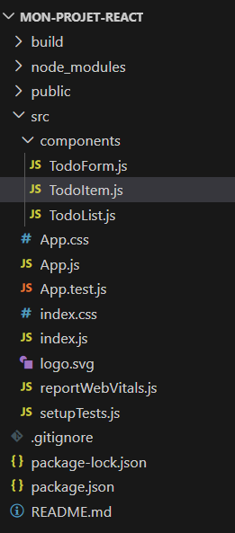
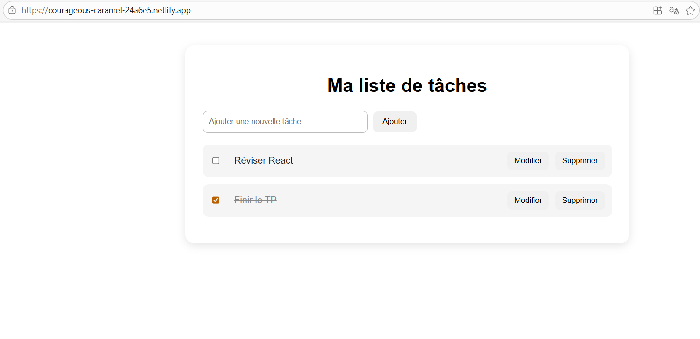
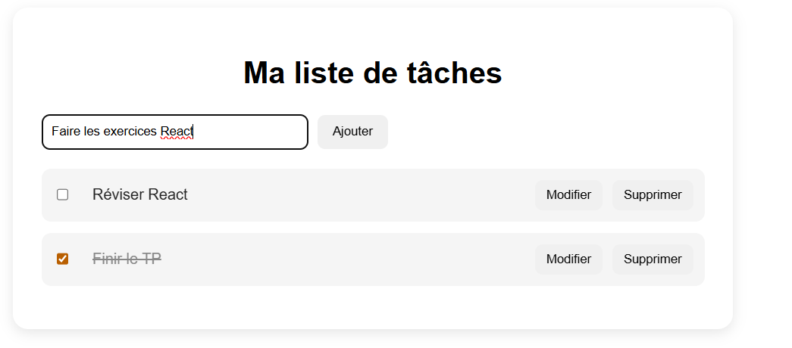
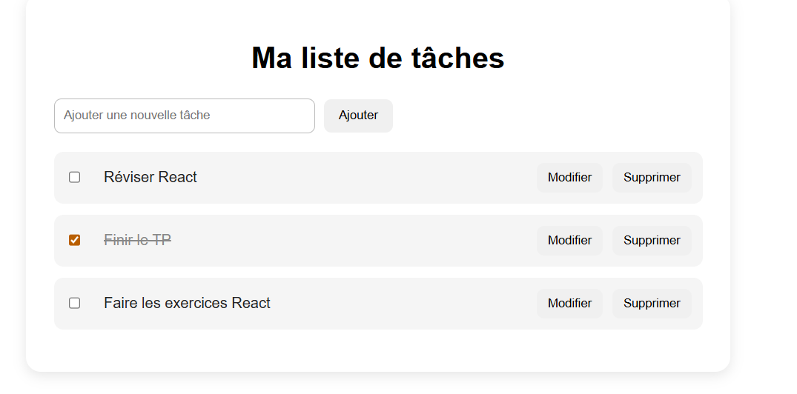
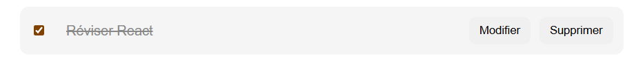
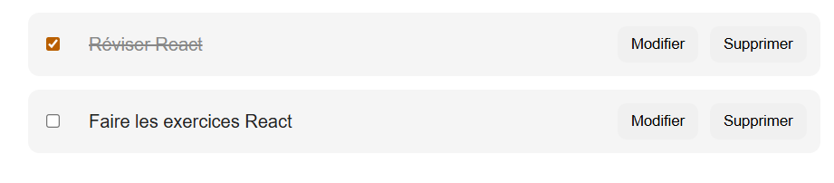
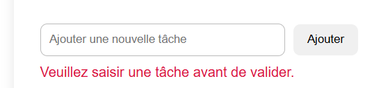
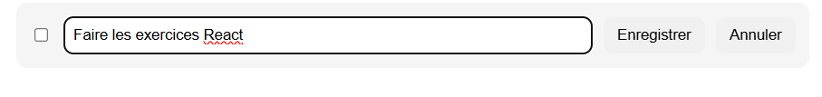
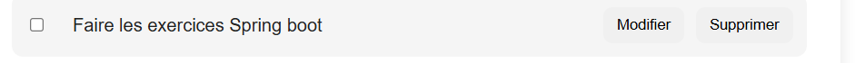

# Application *To-Do List Interactive* (React)

## Technologies utilisées
- React (Create React App)
- JavaScript (ES6)
- HTML / CSS
- React Hooks (useState)
---
## Structure du projet

---
## Interface principale

---
## Ajout d’une tâche

---
## Tâche cochée

---
## Suppression

---
## Message d’erreur

---
## Modification d’une tâche

---
## Déploiement

L’application a été déployée avec Netlify.

 *Lien du projet en ligne* :

https://courageous-caramel-24a6e5.netlify.app/